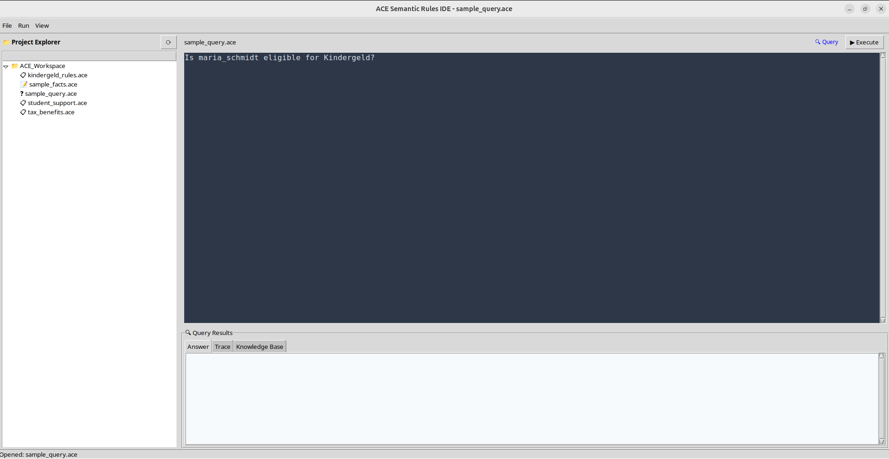

# AceCode

Combines a neuro-symbolic AI system (see Neural | Symbolic Type) with Attempto Controlled English, which is a controlled natural language that looks like English but is formally defined and as powerful as first order logic.

## Demo Video

https://makertube.net/w/hzAdbd5UUCEnRE5jwjYboV

## Screenshots:

The user can upload data as a CSV-file which is turned into human-readable, but also inferable ACE code.
It is then possible to run human-readable queries on this data.

## Other Thoughts

For the universal processing of documents based on attempto controlled german (based on https://en.wikipedia.org/wiki/Attempto_Controlled_English).

Counter-design to vibe-coding:

1. Instead of "everything goes" the parser excepts a given syntax. Therefore, users need to be precise instead of improving the output with blurry prompt-engineer "rules".
2. It's not expected to have the prompt ready right from the start. Users are invited to spend time crafting and polishing their "prompts", before they execute them.
3. The prompts are treated more like one whole source code that is optimized over time rather than a history of chat exchanges, which is re-created on every new prompt. Therefore the UI looks more like an IDE than a chat. The user is creating code that stabilizes incrementally over time rather than having chaning/deleteing/removing parts of the code by the AI at random, hoping that parts of the code will eventually stabilize because of a lucky prompt.

The fundamental idea behind all of this is to give users back control on their language, with which they interact with their data as well as the underlying description of whatever they are trying to create/describe or retrieve. Instead of the alchemistic streak that vibe coding has, ACE-coding emphasizes the "engineering"-aspect of "prompt-engineering".

## Basic Architecture

